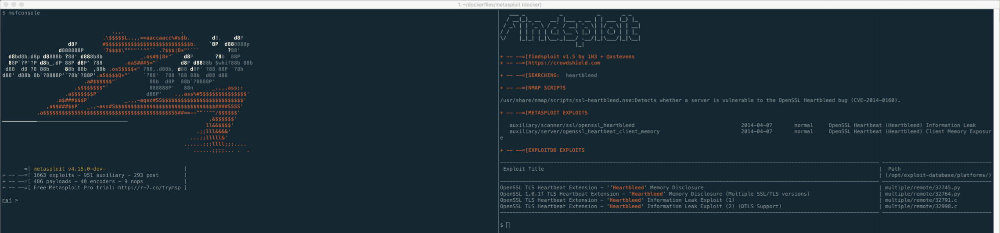

# Metasploit
Source: https://github.com/rapid7/metasploit-framework

## Build
```
docker build -t $USER/metasploit .
```

## First Run
On the very first run you'll want to initialize the db. You only need to do this once if you're mounting the same volume location.

First run the container:
```
$ docker run -it -v $PWD/msf4:/home/msf/.msf4 -v $PWD/tmp:/tmp/data $USER/metasploit /bin/bash
```

Then run:
```
$ msfdb init
```

## Run
After first run, you can just run the container giving it a command. I like to run with `/bin/bash`, so I can exit msfconsole without exiting the container.

```
$ docker run -it -v $PWD/msf4:/home/msf/.msf4 -v $PWD/tmp:/tmp/data $USER/metasploit /bin/bash
```

Once inside the container, then run:
```
$ msfconsole
Found a database at /home/msf/.msf4/db, checking to see if it is started
Starting database at /home/msf/.msf4/db...success
[-] Failed to connect to the database: FATAL:  the database system is starting up


     ,           ,
    /             \
   ((__---,,,---__))
      (_) O O (_)_________
         \ _ /            |\
          o_o \   M S F   | \
               \   _____  |  *
                |||   WW|||
                |||     |||


       =[ metasploit v4.14.25-dev-                        ]
+ -- --=[ 1660 exploits - 950 auxiliary - 293 post        ]
+ -- --=[ 486 payloads - 40 encoders - 9 nops             ]
+ -- --=[ Free Metasploit Pro trial: http://r-7.co/trymsp ]

msf >
```

If you see a `Failed to connect to the database`, don't worry too much about it. You're probably connected by the time console loads. You can verify with `db_status` in the console.

## Docker Compose
If you want to go crazy and run your database in a separate container you can use Docker Compose like so:

```
docker-compose run console /bin/bash
```

When you're done in the console just make sure you remember to shutdown the db container cleanly with:

```
docker-compose stop db
```

# Screenshot
Using tmux to use msfconsole/findsploit at same time:
